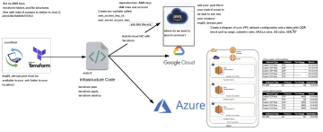

# Terraform

- lightweight and quick setup
- powerful
- .tf syntax files is similar to json {}
- main.tf contains instructions
- set AWS access keys as environment variables - AWS_ACCESS_KEY_ID and AWS_SECRET_ACCESS_KEY
- there are other options - secret.txt, vaults, .gitignore - but variables is most secure
- put .terraform/ in the .gitignore as it gets large and heavy to push every time
- terraform gathers dependencies when it is initialised with `terraform init` using the `main.tf` instructions
- `terraform plan` checks syntax and validates instructions - use it after each instruction is added
- when outcome is all green, run `terraform apply` to run the script
- `terraform destroy` will destroy instances matching the main.tf details
- create pem key pair in AWS and add to .ssh folder to allow SSH access, by adding key into `main.tf`
- can now SSH in from .ssh folder (or location of .pem key)

## Competitors/why terraform
- kubernetes, ansible, packer
- open source, has many plugin options
- works with any cloud service provider
- with each environment change a new version is created - version control can be done if required
- simple to use as much of the work is done in the background
## IAC config management vs orchestration
- Orchestration means arranging or coordinating multiple systems. It’s also used to mean “running the same tasks on a bunch of servers at once, but not necessarily all of them.”
- orchestration tools are designed to automate the deployment of servers and other infrastructure.
- Config Management is part of provisioning, implying it is done once at the beginning to configure a server
- config managment tools help configure the software and systems on this infrastructure that has already been provisioned
## Useful/common commands
- `terraform plan` checks syntax of main.tf file and returns any errors
- `terraform apply` runs the main.tf file
- `terraform destroy` deletes whatever the main.tf file was running

## Steps for network configuration (only public subnet for now)
- this diagram illustrates how an aws infrastructure can be setup and the steps below detail how to configure the public subnet and instance server

- Create a VPC, for me IP is 10.205.0.0/16
- Create an Internet Gateway and attach it to the created VPC
- Create the public subnet, with IP 10.205.1.0/24
- Create a Public Route Table with route 0.0.0.0/0 for all traffic allowed
- Create a Network Access Control List for the public subnet with following rules:

**Inbound**
| Rule Type | Port | Access |
| :---: | :---: | :---: |
| HTTP | 80 | everywhere (IPv4 and IPv6) |
| HTTPS | 443 | everywhere (IPv4 and IPv6) |
| SSH | 22 | Personal IP |
| Custom TCP | 1024-65535 | everywhere (IPv4 and IPv6) |

**Outbound**
| Rule Type | Port | Access |
| :---: | :---: | :---: |
| HTTP | 80 | everywhere (IPv4 and IPv6) |
| HTTPS | 443 | everywhere (IPv4 and IPv6) |
| Custom TCP | 27017 | Database Private IP |
| Custom TCP | 1024-65535 | everywhere (IPv4 and IPv6) |

- Create a Security Group for the public instance server with the following rules:

**Inbound**
| Rule Type | Port | Access |
| :---: | :---: | :---: |
| HTTP | 80 | everywhere (IPv4 and IPv6) |
| HTTPS | 443 | everywhere (IPv4 and IPv6) |
| SSH | 22 | Personal IP |
| Custom TCP | 3000 | everywhere (IPv4 and IPv6) |