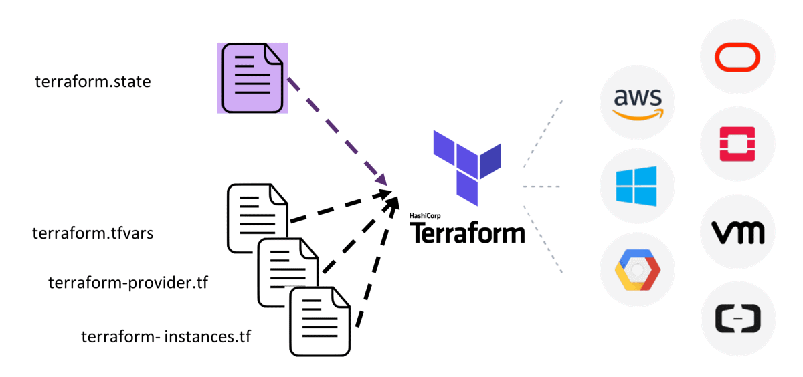

# Terraform

- lightweight and quick setup
- powerful
- .tf syntax files is similar to json {}
- main.tf contains instructions
- set AWS access keys as environment variables - AWS_ACCESS_KEY_ID and AWS_SECRET_ACCESS_KEY
- there are other options - secret.txt, vaults, .gitignore - but variables is most secure
- put .terraform/ in the .gitignore as it gets large and heavy to push every time
- terraform gathers dependencies when it is initialised with `terraform init` using the `main.tf` instructions
- `terraform plan` checks syntax and validates instructions - use it after each instruction is added
- when outcome is all green, run `terraform apply` to run the script
- `terraform destroy` will destroy instances matching the main.tf details
- create pem key pair in AWS and add to .ssh folder to allow SSH access, by adding key into `main.tf`
- can now SSH in from .ssh folder (or location of .pem key)

## Terraform benefits
## Competitors/why terraform
## IAC config management vs orchestration
## Useful/common commands